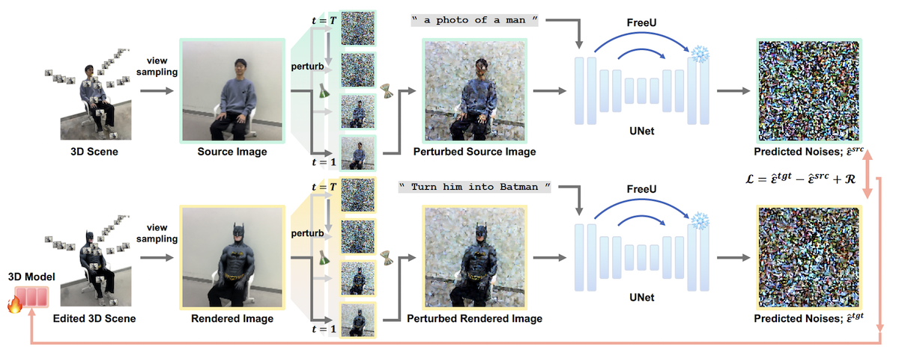

<!--

DreamCatalyst

Authors
* Jiwook Kim (https://github.com/tom919654)
* Seonho Lee (https://github.com/glanceyes)
* Jaeyo Shin (https://github.com/j-mayo)
* Jiho Choi (https://github.com/JihoChoi)

-->


<h1 align="center">

DreamCatalyst: Fast and High-Quality 3D Editing via Controlling Editability and Identity Preservation
</h1>
<h4 align="center">
<a href="https://scholar.google.co.kr/citations?user=i0OKV8wAAAAJ&hl=en">Jiwook Kim<sup>*</sup></a>, <a href="https://scholar.google.co.kr/citations?user=DFKGTG0AAAAJ&hl=en">Seonho Lee<sup>*</sup></a>, <a href="https://scholar.google.com/citations?user=UbZM7nQAAAAJ&hl=en">Jaeyo Shin</a>, <a href="https://scholar.google.co.kr/citations?user=uvwpFpIAAAAJ&hl=en">Jiho Choi</a>, <a href="https://scholar.google.co.kr/citations?user=KB5XZGIAAAAJ&hl=en">Hyunjung Shim</a><br>
</h4>
<h5 align="center">
(* indicates equal contribution)<br>
</h5>

<h4 align="center">

[](https://arxiv.org/abs/2407.11394)
[](https://dream-catalyst.github.io/)


This is the official implementation of **DreamCatalyst**.

</h4>


https://github.com/user-attachments/assets/a704b4b1-4a27-445a-8cba-b27f223b824b


<br/>

## News & Updates

- [x] **[2024/10/04]** 🌟 Codes based on the [Threestudio](https://github.com/threestudio-project/threestudio) for our method with Gaussian Editor have been released!

- [x] **[2024/10/02]** 🌟 Codes based on the [Nerfstudio](https://github.com/nerfstudio-project/nerfstudio) have been released!

- [x] **[2024/07/17]** 📄 Our paper is now available! The paper is released [here](https://arxiv.org/abs/2407.11394). 

<br/>

## Introduction

<div align="center">
    
</div>


DreamCatalyst is a novel framework that considers the sampling dynamics of diffusion models in the SDS(Score Distillation Sampling) framework. DreamCatalyst can be applied to various models in 3D editing, such as **NeRF** and **3DGS**. This method aims to reduce training time and improve editing quality. Please refer to the paper for more details.


<br/>

## Architecture




<br/>

## Get Started

We provide the implementation of DreamCatalyst based on the both [NerfStudio](https://github.com/nerfstudio-project/nerfstudio) and [Threestudio](https://github.com/threestudio-project/threestudio) frameworks. Nerfstudio is a framework for <b>NeRF or 3DGS editing</b>. Threestudio is a framework for <b>Gaussian Editor with DreamCatalyst</b>. Please refer to the following instructions.


### Dataset

Please download the dataset from the following link and extract it to the `dataset` directory.

- PDS provides image data for 3D scene. Please download the dataset [here](https://1drv.ms/f/s!AtxL_EOxFeYMk3rftsoc4L8cg0VS?e=Hhbprk). 
This dataset includes 3D scene data from [Instruct-NeRF2NeRF](https://instruct-nerf2nerf.github.io/) as a subset. 
- You do not need to download Dreambooth checkpoints since our method does not require them.

<br/>

For using Threestudio (GaussianEditor), please follow the instruction below and extract the preprocessed COLMAP datasets and source 3DGS in the `colmap` and `scene` directory.

- We provide the COLMAP and intialized 3DGS for source scene. 
    - [COLMAP](https://1drv.ms/u/s!AiR9dYaccIf8gawXADT9x7Trozy-pw?e=TS3V4l)
    - [Source 3DGS](https://1drv.ms/u/s!AiR9dYaccIf8gawW1taPDyVtsUMUFA?e=3Q6Z2v)
- You can use the [dataset](https://1drv.ms/f/s!AtxL_EOxFeYMk3rftsoc4L8cg0VS?e=Hhbprk) provided by PDS mentioned above.
    - Preprocess Dataset: you can follow the instruction of converting the dataset into COLMAP as [3DGS](https://github.com/graphdeco-inria/gaussian-splatting#processing-your-own-scenes).
    - Initialize 3DGS: please follow the instruction of initializing the 3DGS as [3DGS](https://github.com/graphdeco-inria/gaussian-splatting#evaluation). you can find the point cloud `.ply` file. (e.g., `scene/yuseung/point_cloud/iteration_30000/point_cloud.ply`)


<br/>

### For NerfStudio

Please refer to [nerfstudio/README.md](https://github.com/kaist-cvml/DreamCatalyst/blob/main/nerfstudio/README.md).

<br/>


### For Threestudio

Please refer to [threestudio/README.md](https://github.com/kaist-cvml/DreamCatalyst/blob/main/threestudio/README.md).


<br/>


## Citation

If you find our work useful in your research, please cite:

```BiBTeX
@misc{kim2024dreamcatalystfasthighquality3d,
      title={DreamCatalyst: Fast and High-Quality 3D Editing via Controlling Editability and Identity Preservation}, 
      author={Jiwook Kim and Seonho Lee and Jaeyo Shin and Jiho Choi and Hyunjung Shim},
      year={2024},
      eprint={2407.11394},
      archivePrefix={arXiv},
      primaryClass={cs.CV},
      url={https://arxiv.org/abs/2407.11394, 
}
```

<br/>

## Acknowledgement

We would like to express our gratitude to the following works:

- [PDS](https://posterior-distillation-sampling.github.io/)
- [Instruct-Nerf2Nerf](https://instruct-nerf2nerf.github.io/)
- [InstructPix2Pix](https://github.com/timothybrooks/instruct-pix2pix) 
- [Gaussian Editor](https://github.com/buaacyw/GaussianEditor) 
- [FreeU](https://github.com/ChenyangSi/FreeU) 
- [DreamSampler](https://arxiv.org/abs/2403.11415)
- [SDEdit](https://sde-image-editing.github.io/)
