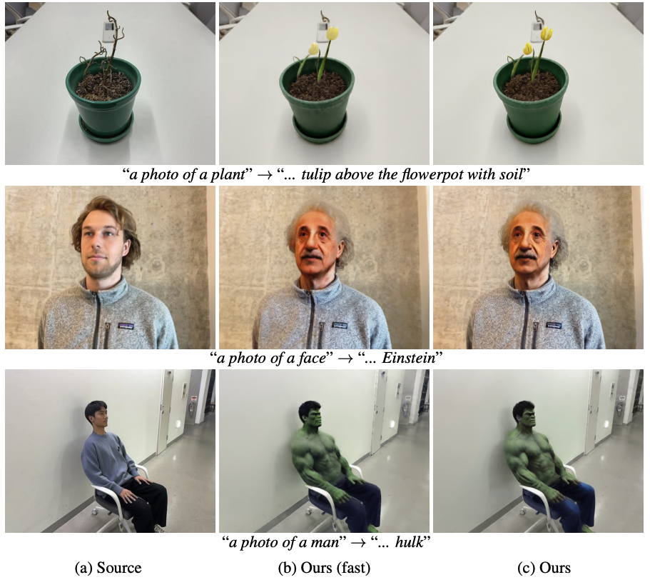

# 3D editing with DreamCatalyst

<div align="center">
    
</div>

Above are the examples of NeRF editing with DreamCatalyst. The leftmost images are the original 3D scene, and the rightmost images are the edited 3D scene. The middle images are the fast mode results of our method.

These codes are based on [Nerfstudio](https://docs.nerf.studio/). We follow the same training procedure as the [PDS](https://github.com/KAIST-Visual-AI-Group/PDS/) except for refinement stage.

<br/>

## Setup

Assuming you are in the `nerfstudio` directory.

```bash
cd ./nerfstudio
```

<br/>

First, create and activate a new virtual(conda) environment.

```bash
conda create -n dreamcatalyst python=3.9
conda activate dreamcatalyst
```

Then, install the required packages.

```bash
pip install torch==2.1.2+cu118 torchvision==0.16.2+cu118 --extra-index-url https://download.pytorch.org/whl/cu118
conda install -c "nvidia/label/cuda-11.8.0" cuda-toolkit
pip install ninja git+https://github.com/NVlabs/tiny-cuda-nn/#subdirectory=bindings/torch
pip install -e .
```

For 3D editing with DreamCatalyst, you need to install the following packages.

```bash
cd 3d_editing
pip install -e .
pip install numpy==1.26.4
pip install gsplat==0.1.6
```

You should be able to see `dc` and `dc_splat` if the installation is successful in the following commands.

```bash
cd ..
ns-train -h
```

<br/>

## RUN


### Initialize 3D Scenes


<b>NeRF</b>

```bash
ns-train nerfacto --data ../dataset/{dataset_name} --pipeline.model.use_appearance_embedding False

# Example
ns-train nerfacto --data ../dataset/yuseung --pipeline.model.use_appearance_embedding False
```


<b>3DGS</b>

```bash
ns-train splatfacto --data ../dataset/{dataset_name}

# Example
ns-train splatfacto --data ../dataset/yuseung
```

You can see that the outputs are saved in the `outputs/{dataset_name}/{model_name}/{timestamp}` directory. (e.g., `outputs/yuseung/nerfacto/2024-10-02_000000` for NeRF, `outputs/yuseung/splatfacto/2024-10-02_000000` for 3DGS)


<br/>

### Edit 3D Scenes

<b>NeRF</b>

```bash
ns-train dc --data ../dataset/{dataset_name} --load-dir outputs/{dataset_name}/{model_name}/{timestamp}/nerfstudio_models/ \
 --pipeline.dc.src_prompt {source_prompt} \
 --pipeline.dc.tgt_prompt {target_prompt} \
 --vis viewer \
 --max_num_iterations 3000 \
 --pipeline.dc.freeu_b1 1.1 \
 --pipeline.dc.freeu_b2 1.1 \
 --pipeline.dc.freeu_s1 0.9 \
 --pipeline.dc.freeu_s2 0.2 \
 --pipeline.dc.sd_pretrained_model_or_path timbrooks/instruct-pix2pix

 # Example
 ns-train dc --data ../dataset/{dataset_name} --load-dir outputs/yuseung/nerfacto/2024-10-02_000000/nerfstudio_models/ \
 --pipeline.dc.src_prompt "a photo of a man" \
 --pipeline.dc.tgt_prompt "Turn him into a Batman" \
 --vis viewer \
 --max_num_iterations 3000 \
 --pipeline.dc.freeu_b1 1.1 \
 --pipeline.dc.freeu_b2 1.1 \
 --pipeline.dc.freeu_s1 0.9 \
 --pipeline.dc.freeu_s2 0.2 \
 --pipeline.dc.sd_pretrained_model_or_path timbrooks/instruct-pix2pix
```

You can use the <u>fast mode</u> by setting `max_num_iterations 3000` to `max_num_iterations 1000`.


<b>3DGS</b>

```bash
ns-train dc_splat --data ../dataset/{dataset_name} --load-dir outputs/{dataset_name}/{model_name}/{timestamp}/nerfstudio_models/ \
 --pipeline.dc.src_prompt {source_prompt} \
 --pipeline.dc.tgt_prompt {target_prompt} \
 --vis viewer \
 --max_num_iterations 3000 \
 --pipeline.dc.freeu_b1 1.1 \
 --pipeline.dc.freeu_b2 1.1 \
 --pipeline.dc.freeu_s1 0.9 \
 --pipeline.dc.freeu_s2 0.2 \
 --pipeline.dc.sd_pretrained_model_or_path timbrooks/instruct-pix2pix

 # Example
  ns-train dc --data ../dataset/{dataset_name} --load-dir outputs/yuseung/splatfacto/2024-10-02_000000/nerfstudio_models/ \
 --pipeline.dc.src_prompt "a photo of a man" \
 --pipeline.dc.tgt_prompt "Turn him into a Batman" \
 --vis viewer \
 --max_num_iterations 3000 \
 --pipeline.dc.freeu_b1 1.1 \
 --pipeline.dc.freeu_b2 1.1 \
 --pipeline.dc.freeu_s1 0.9 \
 --pipeline.dc.freeu_s2 0.2 \
 --pipeline.dc.sd_pretrained_model_or_path timbrooks/instruct-pix2pix
```

<br/>

## Controlling Editability and Identity Preservation

You can control the balance between editability and identity preservation by adjusting the following parameters:

`pipeline.dc.chi`: Control the weight for identity preservation.
`pipeline.dc.delta` and `pipeline.dc.gamma`: Controls the weight for editability.

The default values are set to:

`pipeline.dc.chi`: 0.075

`pipeline.dc.delta`: 0.2

`pipeline.dc.gamma`: 0.8

For further explanation of how these parameters affect the editing process, please refer to Equation (18) in the [paper](https://arxiv.org/abs/2407.11394).


<br/>

## Script Files

We provide the script files for the examples of `face` scene. You can find the script files in the `scripts` directory. Please change `{timestamp}` to the timestamp of the model you want to use.


<br/>