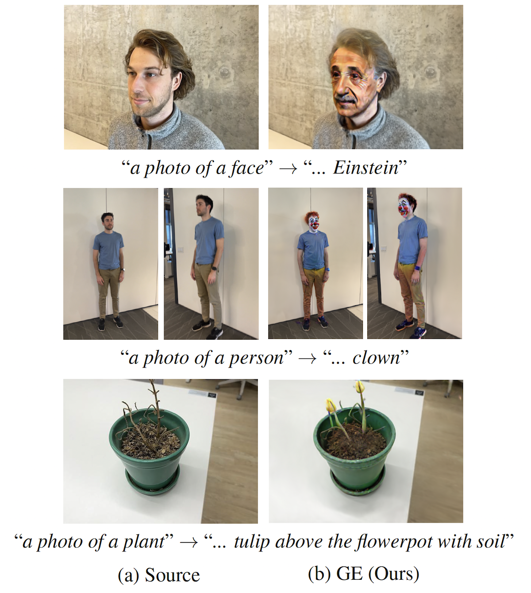

# GaussianEditor with DreamCatalyst

<div align="center">
    
</div>

Above are the examples of GaussianEditor with DreamCatalyst. The leftmost images are the original 3D scene, and the rightmost images are the edited 3D scene.

These codes are based on [GaussianEditor](https://github.com/buaacyw/GaussianEditor/).

<br/>


## Setup

Assuming you are in the `nerfstudio` directory.

```bash
cd ./nerfstudio
```

<br/>

First, create and activate a new virtual(conda) environment.

```bash
conda create -n ge_dreamcatalyst python=3.8 -y 
conda activate ge_dreamcatalyst
```

Then, install the required packages.

```bash
conda install -c "nvidia/label/cuda-11.7.0" cuda-nvcc
conda install cuda-toolkit==11.7
pip install ninja
pip install cmake
conda install pytorch==2.0.1 torchvision==0.15.2 torchaudio==2.0.2 pytorch-cuda=11.7 -c pytorch -c nvidia

# Gaussian Splatting
cd gaussiansplatting
pip install submodules/diff-gaussian-rasterization
pip install submodules/simple-knn

# Required packages
cd ..
pip install tqdm
pip install plyfile
pip install mediapipe
pip install diffusers==0.27.2
pip install -r requirements_all.txt
```

<br/>

## RUN

Assuming you have the preprocessed datasets in the `colmap` and `scene` directory.


### Edit 3D Scenes

```bash
python launch.py --config configs/edit-dc.yaml --train --gpu 0 \
    system.seg_prompt={seg_prompt} \
    exp_root_dir={output_dir} \
    trainer.max_steps=1500 \
    system.prompt_processor.prompt={target_prompt} \
    system.dds_target_prompt_processor.prompt={target_prompt} \
    system.dds_source_prompt_processor.prompt={source_prompt} \
    system.max_densify_percent=0.01 \
    system.anchor_weight_init_g0=0.05 \
    system.anchor_weight_init=0.1 \
    system.anchor_weight_multiplier=1.3 \
    system.gs_lr_scaler=1 \
    system.gs_final_lr_scaler=1 \
    system.color_lr_scaler=1 \
    system.opacity_lr_scaler=1 \
    system.scaling_lr_scaler=1 \
    system.rotation_lr_scaler=1 \
    system.loss.lambda_anchor_color=5 \
    system.loss.lambda_anchor_geo=5 \
    system.loss.lambda_anchor_scale=5 \
    system.loss.lambda_anchor_opacity=5 \
    system.densify_from_iter=100 \
    system.densify_until_iter=1201 \
    system.densification_interval=100 \
    system.second_guidance.chi=0.075 \
    system.second_guidance.delta=0.05 \
    system.second_guidance.gamma=0.2 \
    data.source={dataset_dir} \
    system.gs_source={scene_dir}
```

<br/> 

<b>Arguments</b>

- `system.seg_prompt`: The segmentation prompt for the target object from GaussianEditor. It constrains the editing region as a mask along with the segmentation prompt.
- `exp_root_dir`: The output directory.
- `trainer.max_steps`: The maximum number of training steps. If you use the <b>fast mode</b>, you can set it to `1200`.
- `system.prompt_processor.prompt`: The target prompt for the target object.
- `system.dds_target_prompt_processor.prompt`: The target prompt for the target object in the DDS module.
- `system.dds_source_prompt_processor.prompt`: The source prompt for the source object in the DDS module.
- `data.source`: The dataset directory.
- `system.gs_source`: The scene directory. It should be the point cloud data of the source object.

<br/>

```bash
# Example 
python launch.py --config configs/edit-dc.yaml --train --gpu 0 \
    system.seg_prompt="a man" \
    exp_root_dir=outputs/yuseung \
    trainer.max_steps=1500 \
    system.prompt_processor.prompt="Turn him into a Batman" \
    system.dds_target_prompt_processor.prompt="Turn him into a Batman" \
    system.dds_source_prompt_processor.prompt="a photo of a man" \
    system.max_densify_percent=0.01 \
    system.anchor_weight_init_g0=0.05 \
    system.anchor_weight_init=0.1 \
    system.anchor_weight_multiplier=1.3 \
    system.gs_lr_scaler=1 \
    system.gs_final_lr_scaler=1 \
    system.color_lr_scaler=1 \
    system.opacity_lr_scaler=1 \
    system.scaling_lr_scaler=1 \
    system.rotation_lr_scaler=1 \
    system.loss.lambda_anchor_color=5 \
    system.loss.lambda_anchor_geo=5 \
    system.loss.lambda_anchor_scale=5 \
    system.loss.lambda_anchor_opacity=5 \
    system.densify_from_iter=100 \
    system.densify_until_iter=1201 \
    system.densification_interval=100 \
    system.second_guidance.chi=0.075 \
    system.second_guidance.delta=0.05 \
    system.second_guidance.gamma=0.2 \
    data.source=../colmap/yuseung \
    system.gs_source=../scene/yuseung/point_cloud/iteration_30000/point_cloud.ply
```
<br/>

## Controlling Editability and Identity Preservation

You can control the balance between editability and identity preservation by adjusting the following parameters:

`system.second_guidance.chi`: Control the weight for identity preservation.
`system.second_guidance.delta` and `system.second_guidance.gamma`: Controls the weight for editability.

The default values are set to:

`system.second_guidance.chi`: 0.075

`system.second_guidance.delta`: 0.05

`system.second_guidance.gamma`: 0.2

<br/>

## Script Files

We provide the script files for the examples of `face` scene. You can find the script files in the `scripts` directory. Please change `{timestamp}` to the timestamp of the model you want to use.
